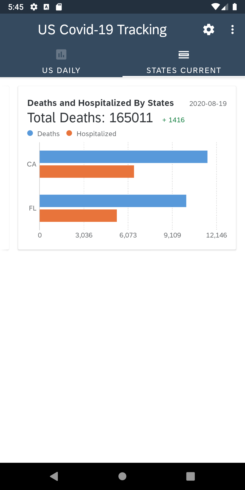

# SAP Fiori Chart Cards Demo Application

## Description

This application demonstrates how to utilize the Chart Cards views in the SAP Fiori UI library. The app is intended to provide an example implementation of these controls with a real network API data source, i.e. the [COVID Tracking APIs](https://covidtracking.com/data/api), so that users can understand how to use the SAP Fiori Chart Cards views to expand the functionality of their own applications.

If you are new to the SAP BTP SDK for Android, [Get Started with SAP BTP SDK for Android](https://developers.sap.com/mission.sdk-android-get-started.html), [Step by Step with the SAP BTP SDK for Android](https://blogs.sap.com/2018/10/15/step-by-step-with-the-sap-cloud-platform-sdk-for-android-part-1/) series, and the [SAP BTP SDK for Android Learning Journey](https://help.sap.com/doc/221f8f84afef43d29ad37ef2af0c4adf/HP_2.0/en-US/747d6d2ea0534ba99612920c7402631a.html) are great places to start.

### The Finished Product

The app makes HTTP requests to the [COVID Tracking APIs](https://covidtracking.com/data/api) to retrieve US Daily and States Current COVID-19 data. Then the data is transformed into ChartCardDataModel objects which are displayed in the Chart Cards view from the SAP Fiori UI library. In case the network service is unavailable, an offline mode allows retrieval of COVID-19 data from locally stored JSON documents.

|  | 
|:---:|
| US Daily COVID-19 Data in Base Cards |

|  | 
|:---:|
| States Current COVID-19 Data in Scrollable Cards |

|  | 
|:---:|
| Total COVID-19 Cases by States in Column Chart View |

## Requirements

* [Android Studio](https://developer.android.com/studio/index.html) version 3.6
* [SAP BTP SDK for Android from Trial Downloads](https://developers.sap.com/trials-downloads.html?search=android) or [SAP BTP SDK for Android from Software Downloads](https://launchpad.support.sap.com/#/softwarecenter/template/products/_APP=00200682500000001943&_EVENT=NEXT&HEADER=Y&FUNCTIONBAR=Y&EVENT=TREE&NE=NAVIGATE&ENR=73555000100800001281&V=MAINT&TA=ACTUAL/SAP%20CP%20SDK%20FOR%20AND) version 3.1.3 or higher.

The blog [Step by Step with the SAP BTP SDK for Android](https://blogs.sap.com/2018/10/15/step-by-step-with-the-sap-cloud-platform-sdk-for-android-part-1/) contains additional details on how to setup and install the SDK.

There is a dedicated section in the [Fiori for Android Design Guidelines](https://experience.sap.com/fiori-design-android/explore/) which explains the [Chart](https://experience.sap.com/fiori-design-android/chart-overview/) and [Chart Card](https://experience.sap.com/fiori-design-android/chart-card/) components.

[SAP BTP Mobile Services Documentation](https://help.sap.com/doc/f53c64b93e5140918d676b927a3cd65b/Cloud/en-US/docs-en/guides/features/fiori-ui/overview.html) provides more technical details on how to use the [Chart Cards](https://help.sap.com/doc/f53c64b93e5140918d676b927a3cd65b/Cloud/en-US/docs-en/guides/features/fiori-ui/android/chart-card.html) component in an Android application.

## Limitations

In order to run the project properly, you need to follow the configuration steps below:

1. Open the project in Android Studio.
2. To successfully run the application, the `sdkVersion` variable in the `gradle.properties` file needs to be set correctly. Depending on which version of the SDK you have installed (e.g. `3.1.3`), change the variable as shown in the screenshot below.

3. Run the project to deploy it onto an emulator or device.

## Known Issues

There are no known issues at this time.

## How to obtain support

If you have questions/comments/suggestions regarding this app please
post them using the tag [SAP BTP SDK for Android](https://answers.sap.com/tags/73555000100800001281) or if you encounter an issue, you can [create a ticket](https://github.com/SAP/cloud-sdk-android-fiori-ui-components/issues/new).

## Contributing

Currently this project is only being updated and maintained by SAP employees.

## License

Copyright (c) 2020 SAP SE or an SAP affiliate company. All rights reserved. This project is licensed under the Apache Software License, v. 2 except as noted otherwise in the [License](LICENSES/Apache-2.0.txt) file.

### Attribution

The [COVID Tracking APIs](https://covidtracking.com/data/api) used in this project is taken from [The COVID Tracking Project](https://covidtracking.com/about) which is "a volunteer organization launched from The Atlantic and dedicated to collecting and publishing the data required to understand the COVID-19 outbreak in the United States."

The COVID Tracking Project at The Atlantic’s data and website content is published under a [Creative Commons CC BY 4.0](https://creativecommons.org/licenses/by/4.0/) license. The data APIs are used in this project without any modifications.
